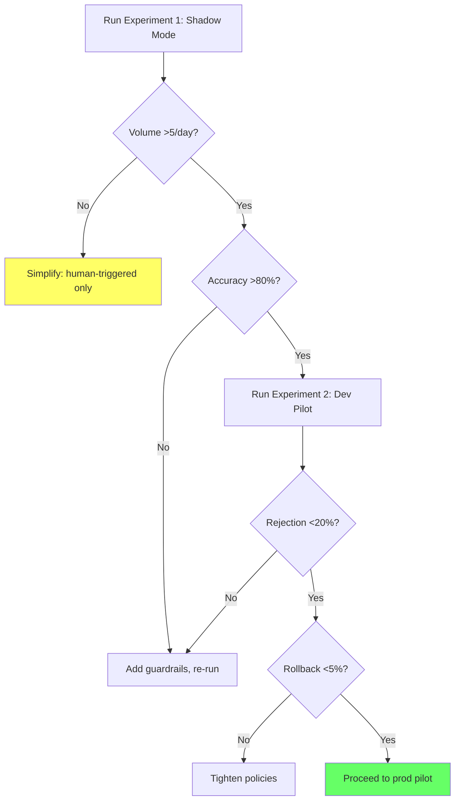

# Agent Interaction Model: Validation Criteria

**Status**: Validation framework for ISSUE-20.5
**Related**: [design-agent-proposal-workflow.md](design-agent-proposal-workflow.md), [approval-fatigue-and-theater.md](approval-fatigue-and-theater.md)

---

## Purpose

EPIC-15 assumes agents will propose infrastructure changes at high velocity. Before heavy implementation investment, we should validate these assumptions with low-cost experiments.

---

## Key Assumptions

| # | Assumption | If True | If False |
|---|------------|---------|----------|
| A1 | Agents will propose config changes frequently (10+/day) | Need robust approval workflow | Simpler workflow sufficient |
| A2 | Agent proposals will be mostly correct (>90%) | Auto-approve LOW/MEDIUM viable | Need more human review |
| A3 | Agents will propose changes humans wouldn't think of | Adds unique value | Just automation of human intent |
| A4 | Multiple agents will propose competing changes | Need conflict resolution | Single-agent model sufficient |
| A5 | Agent velocity will exceed human review capacity | Need acknowledgment model | Traditional approval works |

---

## Validation Criteria

| Assumption | Confirmed If | Refuted If |
|------------|--------------|------------|
| A1 (high velocity) | >10 proposals/day sustained for 2+ weeks | <3 proposals/day after 1 month |
| A2 (high accuracy) | >90% proposals applied without rollback | >20% proposals rejected or rolled back |
| A3 (novel proposals) | >30% proposals not prompted by human request | 100% proposals are human-requested |
| A4 (competing agents) | >1 conflict/week between agent proposals | Zero conflicts after 1 month |
| A5 (exceeds capacity) | Review backlog grows despite effort | Humans keep up with all proposals |

---

## Proposed Experiments

### Experiment 1: Shadow Mode Trial (2 weeks)

**Setup**: Agent proposes changes but does not apply them. Human reviews proposals and records what they would have done.

**Measures**:
- Proposal volume (validates A1)
- Accuracy vs human judgment (validates A2)
- Novel vs prompted proposals (validates A3)

**Cost**: Low — no infrastructure changes, just logging and review.

**Decision point**: If <5 proposals/day or <70% accuracy, reconsider agent-first design.

---

### Experiment 2: Single-Environment Pilot (4 weeks)

**Setup**: Enable agent proposals in dev environment only. Full workflow with acknowledgment/approval gates.

**Measures**:
- Time from proposal to apply (workflow efficiency)
- Rejection rate and reasons (accuracy, appropriateness)
- Human intervention rate (validates A5)
- Rollback rate (validates A2)

**Cost**: Medium — real changes in dev, but no prod risk.

**Decision point**: If rejection rate >30% or rollback rate >10%, add more guardrails before prod.

---

### Experiment 3: Competitive Agent Simulation (1 week)

**Setup**: Run two agents with overlapping scope. Observe conflict frequency and resolution.

**Measures**:
- Conflict rate (validates A4)
- Conflict types (same field, same resource, timing)
- Resolution complexity

**Cost**: Low — can run in isolated test environment.

**Decision point**: If >5 conflicts/week, implement explicit conflict resolution before multi-agent deployment.

---

## Decision Framework

*Figure: Decision tree for validating agent interaction model before production deployment.*

---

## What Would Change the Design

| Evidence | Design Change |
|----------|---------------|
| Low proposal volume (<3/day) | Remove acknowledgment model; use simple approval for all |
| Low accuracy (<70%) | Require approval for all risk levels, not just HIGH |
| No novel proposals | Reframe agents as "automation" not "autonomous actors" |
| No competing agents | Remove conflict resolution complexity |
| Humans keep up easily | Remove auto-apply; all changes get explicit approval |

---

## Timeline

| Phase | Duration | Gate |
|-------|----------|------|
| Experiment 1 (Shadow) | 2 weeks | Volume + accuracy thresholds |
| Experiment 2 (Dev Pilot) | 4 weeks | Rejection + rollback thresholds |
| Experiment 3 (Multi-agent) | 1 week | Conflict rate threshold |
| Production Pilot | 4 weeks | All metrics sustained |

Total validation period: ~11 weeks before full production deployment.

---

## References

- [design-agent-proposal-workflow.md](design-agent-proposal-workflow.md)
- [approval-fatigue-and-theater.md](approval-fatigue-and-theater.md)
- [risk-taxonomy.md](risk-taxonomy.md)
