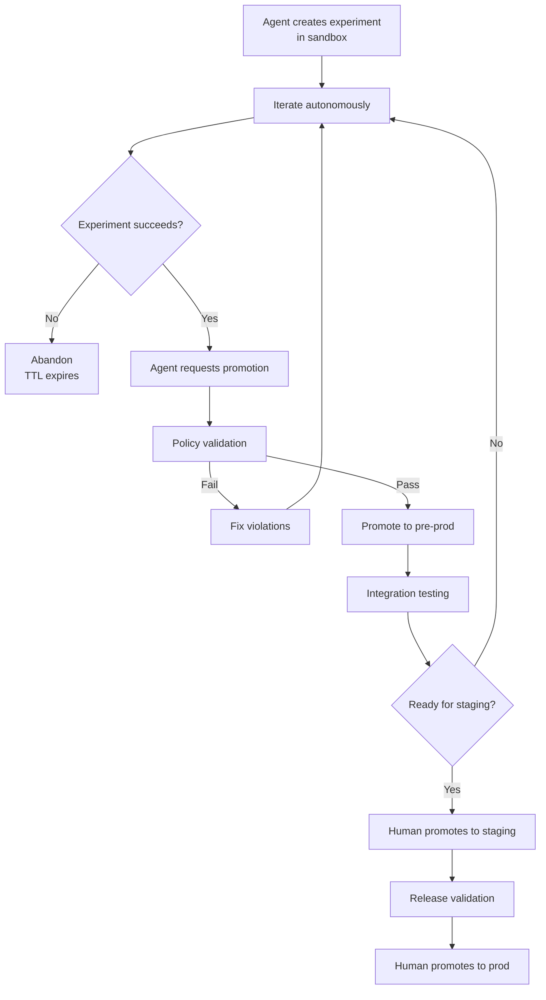

# Agent Freedoms in Non-Production Environments

**Status**: Design document for ISSUE-18.4
**Related**: [Tiered Authority Model](tiered-authority-model.md), [Agent Proposal Workflow](design-agent-proposal-workflow.md), [Risk Taxonomy](risk-taxonomy.md)

---

## Principle

**Agents need room to experiment. Production needs protection from experiments.**

In sandbox and pre-prod tiers, agents can operate with significant autonomy. The goal is fast iteration, not gatekeeping. Observability and audit replace approval workflows.

---

## Agent Capabilities by Tier

| Capability | Sandbox | Pre-prod | Staging | Production |
|------------|---------|----------|---------|------------|
| Create config | ✓ Auto | ✓ Auto | ✓ Auto | ✓ Auto |
| Update LOW risk | ✓ Auto | ✓ Auto | ✓ Auto | ✓ Auto |
| Update MEDIUM risk | ✓ Auto | ✓ Auto | Ack | Ack |
| Update HIGH risk | ✓ Auto | Lead | Approval | Multi-party |
| Delete config | ✓ Auto | ✓ Auto | Gate | Gate + approval |
| Promote config | To pre-prod | To staging | To prod | n/a |
| Bulk operations | ✓ Unlimited | ✓ Unlimited | Scoped | Scoped + approval |
| Direct apply | ✓ Yes | ✓ Yes | No | No |

**Key insight**: Sandbox has no gates. Agents can create, modify, delete, and bulk-update without human intervention.

---

## Sandbox: Maximum Freedom

In sandbox, agents operate autonomously within schema bounds.

### What Agents Can Do

```
✓ Create any number of config units
✓ Update any field (including HIGH-risk fields)
✓ Delete any config they created
✓ Run bulk operations across all owned units
✓ Apply directly without proposal workflow
✓ Experiment with invalid configurations (policy warns, doesn't block)
```

### What Agents Cannot Do

```
✗ Access production credentials or secrets
✗ Reference production resources
✗ Promote directly to production (must go through staging)
✗ Disable audit logging
✗ Exceed resource quotas (cost control)
```

### Sandbox Boundaries

| Boundary | Enforcement |
|----------|-------------|
| **Schema** | Must conform to ServerlessEventApp schema |
| **Secrets** | Cannot reference prod secret namespaces |
| **Resources** | Quota limits (e.g., max 10 Lambdas, 5 DynamoDB tables) |
| **Network** | No VPC peering to production |
| **Data** | No access to customer data stores |

---

## Pre-prod: Moderate Freedom

Pre-prod adds light governance while preserving iteration speed.

### What Agents Can Do

```
✓ Create config units (registered in ConfigHub)
✓ Update LOW/MEDIUM risk fields autonomously
✓ Delete stateless resources
✓ Run bulk operations
✓ Promote to staging (with policy validation)
```

### What Requires Human

```
→ HIGH-risk changes need team lead approval
→ Deleting stateful resources needs confirmation
→ Extending TTL beyond 30 days needs justification
```

### Pre-prod Boundaries

Same as sandbox, plus:
- Policy enforcement (warnings become blocks)
- ConfigHub registration required
- Changes visible to team (not just agent owner)

---

## Agent Identity and Ownership

Every agent action is attributed to an identity:

```yaml
unit: messagewall-sandbox-exp-42
metadata:
  owner: agent:claude-code-session-abc123
  created-by: agent:claude-code-session-abc123
  last-modified-by: agent:claude-code-session-abc123

audit:
  - timestamp: 2026-01-18T10:00:00Z
    actor: agent:claude-code-session-abc123
    action: create
  - timestamp: 2026-01-18T10:05:00Z
    actor: agent:claude-code-session-abc123
    action: update
    fields: [spec.memory, spec.timeout]
```

### Identity Format

```
agent:{agent-type}-{session-id}

Examples:
  agent:claude-code-session-abc123
  agent:github-actions-run-456
  agent:argocd-sync-789
```

### Ownership Rules

| Rule | Sandbox | Pre-prod | Staging/Prod |
|------|---------|----------|--------------|
| Agent can modify own config | ✓ | ✓ | Via proposal |
| Agent can modify others' config | ✓ | With permission | Via proposal |
| Agent can delete own config | ✓ | ✓ | Gate required |
| Agent can delete others' config | ✗ | ✗ | ✗ |

---

## Audit Requirements

All agent actions are logged regardless of tier:

### Audit Record

```json
{
  "timestamp": "2026-01-18T10:05:00Z",
  "actor": "agent:claude-code-session-abc123",
  "action": "update",
  "space": "messagewall-sandbox",
  "unit": "messagewall-sandbox-exp-42",
  "tier": "sandbox",
  "changes": {
    "spec.memory": {"old": "256Mi", "new": "512Mi"},
    "spec.timeout": {"old": "30s", "new": "60s"}
  },
  "risk_class": "LOW",
  "approval": "not_required",
  "policy_result": "pass"
}
```

### Audit Retention

| Tier | Retention |
|------|-----------|
| Sandbox | 7 days (or until config expires) |
| Pre-prod | 30 days |
| Staging | 90 days |
| Production | 1 year minimum |

### Queryable Audit

```bash
# What did agent X do today?
cub audit list --actor agent:claude-code-session-abc123 --since 24h

# All sandbox changes in the last hour
cub audit list --space messagewall-sandbox --since 1h

# All HIGH-risk changes by any agent
cub audit list --actor-type agent --risk HIGH
```

---

## Bounded Schema Enforcement

Agents operate within schema constraints even in sandbox:

### Schema as Safety Net

```yaml
# Agent cannot create arbitrary AWS resources
# Must use ServerlessEventApp schema

apiVersion: platform.messagewall.dev/v1
kind: ServerlessEventApp
spec:
  # These fields exist and are validated
  memory: 512Mi      # Valid: 128Mi-3008Mi
  timeout: 60s       # Valid: 1s-900s

  # This would be rejected even in sandbox
  rawLambdaArn: arn:aws:lambda:...  # Field doesn't exist in schema
```

### Why Schema Matters in Sandbox

1. **Prevents drift** — Experiments use same shape as production
2. **Enables promotion** — Valid sandbox config can become prod config
3. **Limits blast radius** — Can't create arbitrary infrastructure
4. **Maintains observability** — Known schema = known metrics/alerts

---

## Resource Quotas

Cost control via per-agent quotas in sandbox:

| Resource | Sandbox Quota | Pre-prod Quota |
|----------|---------------|----------------|
| Config units | 50 | 100 |
| Lambda functions | 10 | 25 |
| DynamoDB tables | 5 | 10 |
| S3 buckets | 3 | 5 |
| Total estimated cost | $50/day | $200/day |

### Quota Enforcement

```bash
# Agent hits quota
$ cub unit create --space messagewall-sandbox ...
Error: Quota exceeded for agent:claude-code-session-abc123
  Lambda functions: 10/10 (limit reached)

Hint: Delete unused experiments or request quota increase
```

### Quota Reset

- Sandbox quotas reset when TTL-expired configs are garbage collected
- Agents can request temporary quota increase with justification

---

## Experiment-to-Production Path

Agent experiments follow a defined promotion path:



**Key point**: Agents can autonomously promote sandbox → pre-prod. Human required for staging → prod.

---

## Example: Agent Experiment Session

```bash
# Agent starts experiment
$ cub unit create messagewall-sandbox-memory-test \
    --space messagewall-sandbox \
    --from-template serverless-event-app \
    --set spec.memory=1024Mi \
    --ttl 24h

# Agent iterates (no approval needed)
$ cub unit update messagewall-sandbox-memory-test \
    --set spec.memory=2048Mi
$ cub unit update messagewall-sandbox-memory-test \
    --set spec.timeout=120s

# Agent runs load test, observes results
# ...

# Experiment succeeds, agent promotes
$ cub unit promote messagewall-sandbox-memory-test \
    --to-space messagewall-preprod \
    --new-name messagewall-preprod-memory-optimized

# Pre-prod: agent continues testing
# Staging/Prod: human takes over
```

---

## Summary

| Aspect | Sandbox | Pre-prod | Staging/Prod |
|--------|---------|----------|--------------|
| **Agent autonomy** | Full | High | Limited |
| **Approval required** | None | HIGH-risk only | MEDIUM+ |
| **Direct apply** | Yes | Yes | No (proposal only) |
| **Audit** | Required | Required | Required |
| **Schema enforcement** | Yes | Yes | Yes |
| **Quotas** | Yes | Yes | n/a |
| **Promotion authority** | To pre-prod | To staging | Human only |

Agents thrive in sandbox: fast iteration, automatic cleanup, no gatekeeping. As configs mature toward production, human oversight increases proportionally.

---

## References

- [Tiered Authority Model](tiered-authority-model.md) — tier definitions
- [Time-Scoped Configuration](time-scoped-configuration.md) — TTL and expiration
- [Agent Proposal Workflow](design-agent-proposal-workflow.md) — how agents propose in higher tiers
- [Risk Taxonomy](risk-taxonomy.md) — LOW/MEDIUM/HIGH definitions
