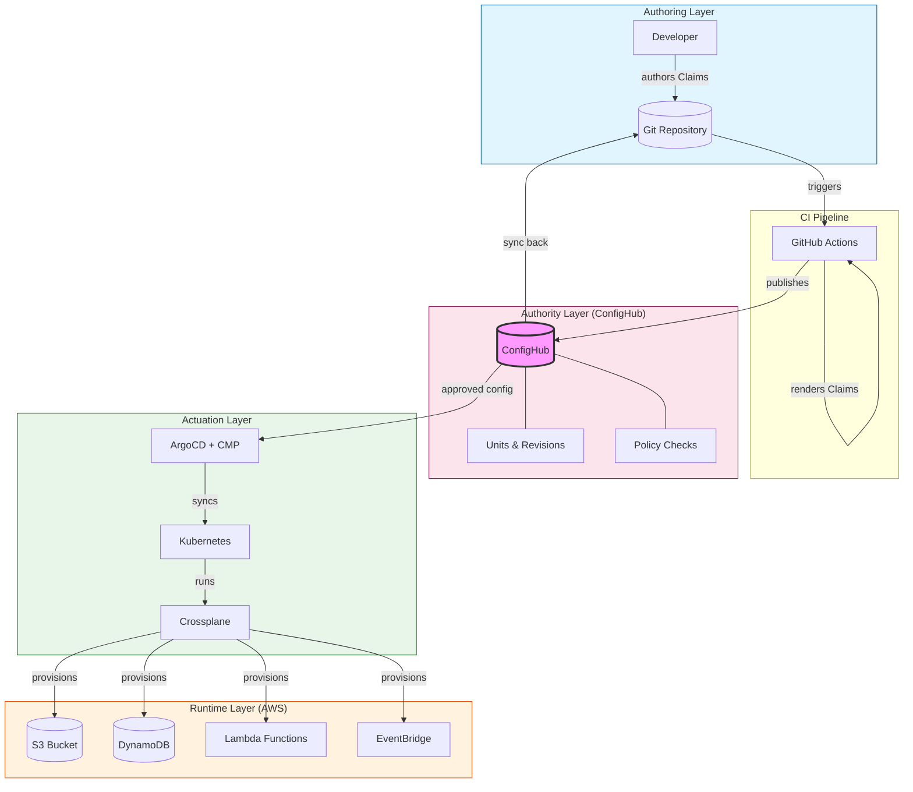
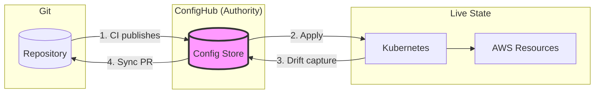

# Configuration Flow Architecture

This diagram shows how configuration flows from developer authoring through ConfigHub to AWS resources.

## Bidirectional GitOps Flow

## Sync Directions

## Component Responsibilities

| Layer | Component | Responsibility |
|-------|-----------|----------------|
| **Authoring** | Git | Developer authoring surface, PR reviews, audit trail |
| **Authoring** | CI | Render Claims, publish to ConfigHub |
| **Authority** | ConfigHub | Authoritative config store, revisions, bulk changes, policy |
| **Actuation** | ArgoCD | Sync ConfigHub → Kubernetes |
| **Actuation** | Crossplane | Expand Claims → AWS managed resources |
| **Runtime** | AWS | S3, DynamoDB, Lambda, EventBridge |

## Related Documents

- [ADR-005: ConfigHub Integration Architecture](decisions/005-confighub-integration-architecture.md)
- [ADR-010: ConfigHub Stores Claims](decisions/010-confighub-claim-vs-expanded.md)
- [ADR-011: Bidirectional GitOps](decisions/011-ci-confighub-authority-conflict.md)
- [Four-Plane Model](planes.md)
