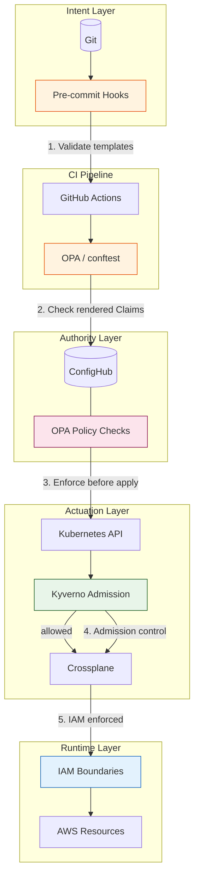

# Configuration Flow Architecture

This diagram shows how configuration flows from developer authoring through ConfigHub to AWS resources.

## Bidirectional GitOps Flow

## Sync Directions

## Component Responsibilities

| Layer | Component | Responsibility |
|-------|-----------|----------------|
| **Authoring** | Git | Developer authoring surface, PR reviews, audit trail |
| **Authoring** | CI | Render Claims, publish to ConfigHub |
| **Authority** | ConfigHub | Authoritative config store, revisions, bulk changes, policy |
| **Actuation** | ArgoCD | Sync ConfigHub → Kubernetes |
| **Actuation** | Crossplane | Expand Claims → AWS managed resources |
| **Actuation** | Kyverno | Admission control, policy enforcement |
| **Runtime** | AWS | S3, DynamoDB, Lambda, EventBridge |

## Policy Enforcement Points (Defense in Depth)

Policies run at multiple layers to catch violations early and provide defense in depth.

### Policy Enforcement Summary

| Enforcement Point | Layer | What It Validates | When |
|-------------------|-------|-------------------|------|
| Pre-commit hooks | Intent | Templates before commit | Developer push |
| CI (conftest) | CI | Rendered Claims | Pull request |
| ConfigHub (OPA) | Authority | Claims before apply | `cub unit apply` |
| Kyverno | Actuation | Kubernetes resources | Admission |
| IAM Boundaries | Runtime | AWS API calls | Resource creation |

### Why Duplicate Policies?

Some policies exist at multiple layers intentionally:
- **Required tags**: ConfigHub validates Claim metadata; Kyverno validates expanded resources
- **Resource constraints**: ConfigHub checks Claim fields; Kyverno validates resource specs

This provides defense in depth—if one layer misses a violation, another catches it.

## Related Documents

- [ADR-005: ConfigHub Integration Architecture](decisions/005-confighub-integration-architecture.md)
- [ADR-010: ConfigHub Stores Claims](decisions/010-confighub-claim-vs-expanded.md)
- [ADR-011: Bidirectional GitOps](decisions/011-ci-confighub-authority-conflict.md)
- [Four-Plane Model](planes.md)
