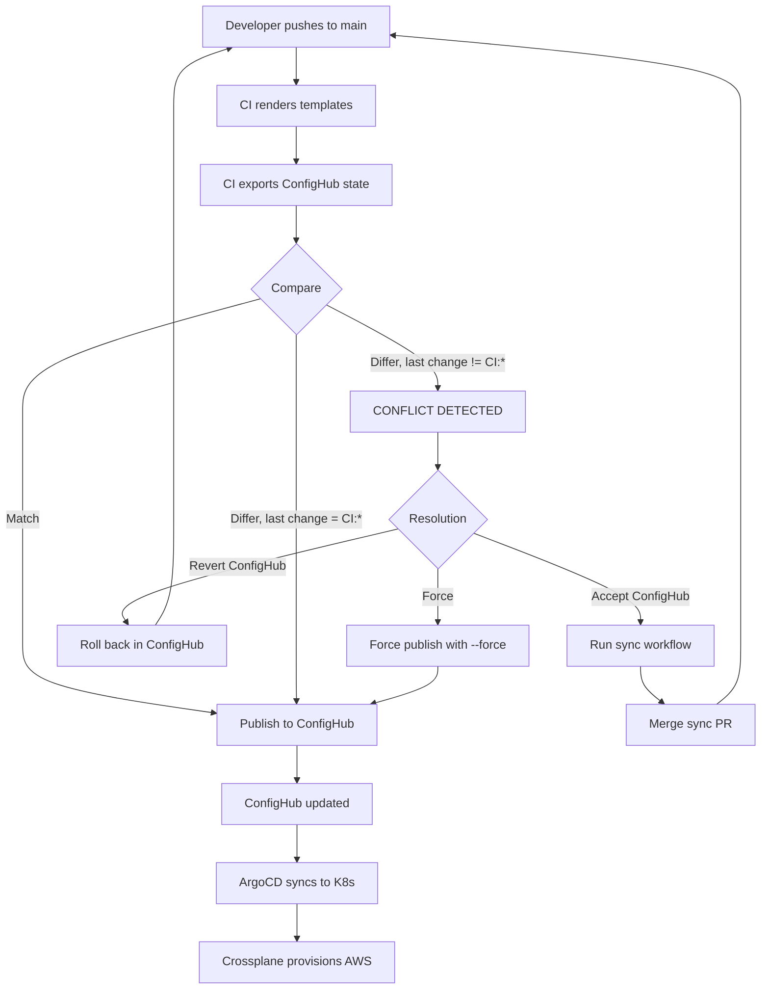

# Bidirectional GitOps with ConfigHub

This document describes the bidirectional sync implementation per [ADR-011](decisions/011-ci-confighub-authority-conflict.md).

## Overview

ConfigHub is the authoritative source for configuration. Changes flow in all directions:

```
                    Git
                (authoring)
                   ↓  ↑
                   │  │ Phase 1 & 2
                   ↓  ↑
    ┌─────────────────────────────────┐
    │     ConfigHub (authority)       │
    │  • Stores resolved Claims       │
    │  • Tracks all revisions         │
    │  • Enables bulk changes         │
    │  • Enforces policies            │
    └─────────────────────────────────┘
                   ↓  ↑
             apply │  │ Phase 3
                   ↓  ↑
              Live State
         (Kubernetes → AWS)
```

## Three Phases

### Phase 1: ConfigHub → Git Sync

When operators make changes in ConfigHub (bulk changes, policy adjustments, break-glass), automation creates a PR to sync back to Git.

**Trigger**: Scheduled (every 6 hours) or manual via workflow

**Implementation**:
- Script: `scripts/sync-confighub-to-git.sh`
- Workflow: `.github/workflows/confighub-sync-to-git.yml`

**What happens**:
1. Export current ConfigHub units
2. Compare with rendered Git templates
3. If different, create PR with ConfigHub state
4. PR allows review before merging

**Benefits**:
- Git stays informed of all changes
- Full history in Git for compliance/audit
- Developers see what operators changed
- Next CI run won't have stale data

### Phase 2: Git → ConfigHub (Conflict Detection)

CI doesn't blindly overwrite ConfigHub. It detects conflicts first.

**Implementation**: Updated `.github/workflows/confighub-publish.yml`

**What happens**:
1. Render Git templates
2. Export current ConfigHub state
3. Compare rendered output with ConfigHub
4. Check if ConfigHub changes came from CI (via change description prefix)
5. If ConfigHub has non-CI changes: **block publish** and require resolution
6. If no conflict or forced: publish as normal

**Conflict detection heuristic**:
- Compare YAML content (normalized)
- Check last change description:
  - Starts with "CI:": expected divergence (CI made the change)
  - Anything else: conflict (non-CI change)

### Phase 3: Live → ConfigHub Capture

When drift is detected or after break-glass, capture live state to ConfigHub.

**Implementation**: `scripts/capture-drift-to-confighub.sh`

**What happens**:
1. Export live state from Kubernetes (Crossplane resources)
2. Compare with ConfigHub state
3. If drift detected, update ConfigHub with live state
4. Tag with "drift-capture" or "break-glass"
5. Optionally trigger ConfigHub → Git sync

**Use cases**:
- After break-glass emergency changes
- Discovered drift from any source
- Reconciliation after incidents

## Conflict Resolution

When Git and ConfigHub diverge, conflicts are surfaced rather than silently resolved.

### Conflict Scenarios

| Scenario | Resolution |
|----------|------------|
| Git has change, ConfigHub unchanged | Auto-apply Git change to ConfigHub |
| ConfigHub has change, Git unchanged | Sync ConfigHub to Git (PR) |
| Both changed (conflict) | CI blocks; operator chooses winner or merges |

### Resolution Options

When CI detects a conflict:

1. **Accept ConfigHub changes**
   - Run ConfigHub → Git sync workflow
   - Merge the resulting PR
   - Re-run CI publish workflow

2. **Revert ConfigHub changes**
   - Use ConfigHub to roll back to previous revision
   - Re-run CI publish workflow

3. **Force publish** (use with caution)
   - Re-run workflow with `force: true`
   - This overwrites ConfigHub, losing ConfigHub-side changes

### Workflow



## Commands Reference

### Sync ConfigHub to Git

```bash
# Preview changes (dry-run)
./scripts/sync-confighub-to-git.sh --dry-run

# Sync dev environment
./scripts/sync-confighub-to-git.sh

# Sync specific environment
./scripts/sync-confighub-to-git.sh --env prod
```

### Capture Live State

```bash
# Capture drift from dev
./scripts/capture-drift-to-confighub.sh

# Capture with incident tag (break-glass)
./scripts/capture-drift-to-confighub.sh --tag break-glass --incident INC-123

# Preview what would be captured
./scripts/capture-drift-to-confighub.sh --dry-run

# Capture and trigger sync to Git
./scripts/capture-drift-to-confighub.sh --trigger-sync
```

### Manual CI Operations

```bash
# Trigger sync workflow
gh workflow run confighub-sync-to-git.yml

# Trigger publish with force (overwrites ConfigHub)
gh workflow run confighub-publish.yml -f force=true
```

## Change Tracking

All changes include tracking information:

**CI changes** (change description prefix):
- `CI: <commit message>` - Normal CI publish
- `CI (forced): <commit message>` - Forced publish

**Drift captures** (annotations):
- `drift-capture/timestamp` - When captured
- `drift-capture/tag` - Type of capture
- `drift-capture/source` - kubernetes-live
- `drift-capture/incident` - Incident ID (if provided)

**Sync PRs**:
- Title: `sync: Import ConfigHub state for <env>`
- Labels: `sync`, `confighub`, `automated`

## Troubleshooting

### CI Blocked by Conflict

**Symptom**: Publish workflow fails with "Conflicts Detected"

**Investigation**:
1. Check workflow summary for conflict details
2. Review which units diverged
3. Check ConfigHub history: `cub unit history --space <space> <unit>`

**Resolution**: See "Resolution Options" above

### Sync PR Has Unexpected Changes

**Symptom**: Sync PR shows changes you didn't make

**Investigation**:
1. Check ConfigHub history for who made the change
2. Look for bulk change operations
3. Check for break-glass activity

**Resolution**:
- If legitimate: merge the PR
- If unexpected: investigate in ConfigHub, possibly roll back

### Live State Not Captured

**Symptom**: `capture-drift-to-confighub.sh` finds no resources

**Investigation**:
1. Verify resources have label `managedBy=messagewall-demo`
2. Check Kubernetes namespace
3. Verify kubectl context

**Resolution**:
- Ensure resources are properly labeled
- Use `--namespace` flag if needed

## Related Documents

- [ADR-011: Bidirectional GitOps](decisions/011-ci-confighub-authority-conflict.md)
- [ADR-005: ConfigHub Integration](decisions/005-confighub-integration-architecture.md)
- [Break-Glass Recovery Demo](../scripts/demo-break-glass-recovery.sh)
