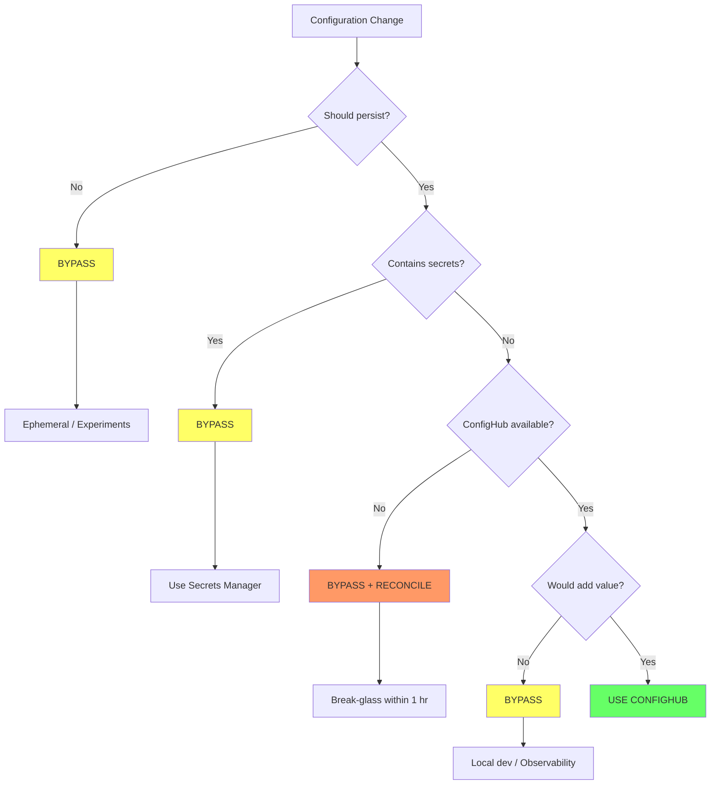

# When to Bypass ConfigHub

**Status**: Policy document for ISSUE-15.18  
**Related**: [ADR-011](decisions/011-ci-confighub-authority-conflict.md), [invariants.md](invariants.md)

---

## Principle

**Use ConfigHub when benefits outweigh costs. Bypass when they don't.**

| Benefits | Costs |
|----------|-------|
| Authority, history, bulk ops, policy | Latency, coordination, complexity |

---

## Bypass Criteria

| # | Scenario | Why Bypass | Reconciliation |
|---|----------|------------|----------------|
| 1 | **Ephemeral resources** (preview envs, CI tests, load tests) | Overhead exceeds resource lifetime | None |
| 2 | **Local development** (kind, Docker Compose, sandboxes) | No org coordination needed | None |
| 3 | **Platform infrastructure** (ConfigHub, ArgoCD, Crossplane, Kyverno) | Circular dependency | Separate bootstrap runbook |
| 4 | **Break-glass emergencies** (outages, ConfigHub down, security incidents) | Speed outweighs coordination | **Required within 1 hour** |
| 5 | **Secrets** (API keys, passwords, TLS private keys) | ConfigHub is not a secrets manager | Store references only |
| 6 | **Real-time operational data** (HPA replicas, cache, routing weights) | This is observed state, not config | None |
| 7 | **Agent experimentation** (local tests, simulations, A/B comparisons) | Don't pollute authority with experiments | Winning variant → proposal |
| 8 | **Observability infrastructure** (Prometheus, Datadog, tracing) | Must exist before ConfigHub | Optional |

---

## Break-Glass Reconciliation

Break-glass is the only bypass requiring mandatory reconciliation:

```bash
# Immediate capture (within 1 hour)
cub drift-capture --space messagewall-prod --tag break-glass \
  --reason "Emergency fix for memory leak"

# Post-incident review
cub revision list --space messagewall-prod --tag break-glass
cub revision show 47 --space messagewall-prod

# Persist or revert
cub revision promote 47 --space messagewall-prod  # Keep
cub revision revert 47 --space messagewall-prod   # Undo
```

---

## What ConfigHub Is NOT

| Not This | Use Instead |
|----------|-------------|
| Secrets manager | AWS Secrets Manager, Vault, K8s Secrets |
| Service mesh control plane | Istio, Linkerd |
| Kubernetes API server | kubectl, direct API for debugging |
| CI/CD pipeline | CI publishes TO ConfigHub |
| Universal governance | Not everything needs authority |

---

## Decision Framework



*Figure: Decision tree for when to use ConfigHub vs. bypass.*

---

## Summary

**Key principles**:
1. ConfigHub is not mandatory for all workflows
2. Bypass when benefits don't outweigh costs
3. Break-glass requires reconciliation within 1 hour
4. Secrets never go in ConfigHub
5. Ephemeral resources don't need governance

---

## References

- [ADR-011: Bidirectional GitOps](decisions/011-ci-confighub-authority-conflict.md)
- [Design: Approval Gates](design-approval-gates.md)
- [Platform Invariants](invariants.md)
- [Runtime Feedback Loops](runtime-feedback-loops.md)
