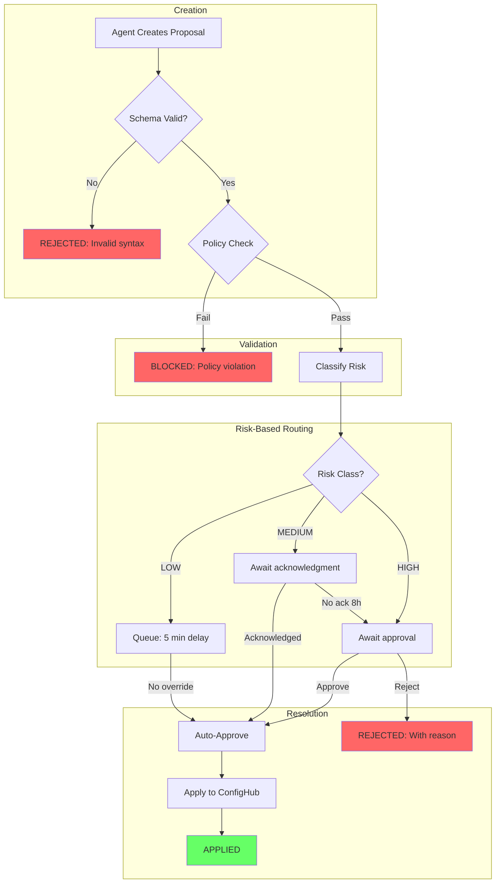

# Design: Agent Proposal Workflow

**Status**: Design document for ISSUE-15.2
**Depends on**: [risk-taxonomy.md](risk-taxonomy.md)

---

## Overview

Agents propose changes that humans (or policy gates) approve before application. This provides oversight while enabling agent-driven improvements.

**Principles**:
1. Agents propose, humans decide (for HIGH risk)
2. Proposals are first-class objects with identity and lifecycle
3. Risk classification determines workflow
4. Proposals validated at submission (syntax + policy)
5. Full audit trail required

---

## Proposal Format

```yaml
apiVersion: proposals.messagewall.demo/v1alpha1
kind: ConfigurationProposal
metadata:
  name: proposal-<uuid>
spec:
  target:
    kind: ServerlessEventAppClaim
    name: messagewall-prod
    space: messagewall-prod
    currentRevision: 42              # Base revision

  change:
    type: patch                      # "patch" or "replacement"
    patch:                           # JSON Patch (RFC 6902)
      - op: replace
        path: /spec/lambdaMemory
        value: 512

  rationale:
    summary: "Increase Lambda memory for cold start performance"
    references: [{ type: metric, source: cloudwatch, id: "..." }]

  proposer:
    type: agent
    id: "claude-code-session-abc123"
    model: "claude-opus-4-5-20251101"
    confidence: 0.85

status:
  riskClass: MEDIUM
  riskRationale: "LOW base + prod elevator"
  policyResult: { outcome: PASS, evaluatedAt: "..." }
  state: pending                     # pending | approved | rejected | applied | expired
  expiresAt: "2026-01-25T10:30:00Z"  # 7-day expiration
```

**Change types**: JSON Patch (preferred for targeted changes) or full replacement (complex restructuring).

---

## Proposal Lifecycle



*Figure: Proposal lifecycle from creation through risk-based routing to resolution. MEDIUM requires acknowledgment; unacknowledged escalates to HIGH.*

**Pending behavior by risk**:
- LOW: Auto-approve after 5 min (human can override)
- MEDIUM: Require acknowledgment within 4h; escalate to HIGH if unacknowledged after 8h
- HIGH: No auto-approve; explicit approval required

---

## Proposal Storage

| Option | Benefits | Limitations |
|--------|----------|-------------|
| **ConfigHub** (preferred) | Full history, policy enforcement, native workflows | Requires ConfigHub proposal support |
| **Git PRs** (Phase 1) | Familiar workflow, works today | No structured schema, harder to query |

**Recommended**: Start with Git PRs (Phase 1), migrate to ConfigHub proposals when available (Phase 2).

---

## Risk Classification Integration

Proposals are classified per [risk-taxonomy.md](risk-taxonomy.md). Classification computed at proposal time:

1. Extract changed fields from patch
2. Get highest base risk from field mapping
3. Apply elevators (prod, deletion, cross-account)

| Risk Class | Notification | Acknowledgment | Approval Required |
|------------|--------------|----------------|-------------------|
| LOW | Optional | No | No (auto-apply 5 min) |
| MEDIUM | Immediate | **Yes** (4h window) | No (after ack) |
| HIGH | Immediate | N/A | **Yes** |

---

## Review Interface

```bash
proposals list --pending              # List pending
proposals show proposal-abc123        # Show details
proposals approve proposal-abc123 --reason "..."   # Approve
proposals reject proposal-abc123 --reason "..."    # Reject
```

**Dashboard** (future): Pending proposals sorted by risk, agent attribution, policy results, diff preview, approve/reject actions.

---

## Agent Constraints

| Agents CAN | Agents CANNOT |
|------------|---------------|
| Create proposals for valid changes | Apply directly (bypass approval) |
| Include rationale and evidence | Approve their own proposals |
| Set confidence level | Modify proposals after submission |
| Create batch proposals | Delete/expire proposals |

**Attribution**: Proposals include `proposer.type`, `proposer.id`, `proposer.model`, `proposer.confidence` for auditing and reliability tracking.

---

## Proposal Expiration

- Proposals expire after **7 days** if not acted upon
- Prevents stale backlogs and outdated revisions being applied
- **Revision staleness**: If target Claim revision advances, block apply (agent must rebase)

---

## Integration Points

- **ISSUE-15.3**: Proposals → Approval Gate → Apply
- **ISSUE-15.13**: AUTO-approve for LOW/MEDIUM reduces approval fatigue
- **ISSUE-15.14**: Future invariants could enable agent-to-agent approval within bounds

---

## Open Questions

| Question | Answer |
|----------|--------|
| Batch proposals? | Yes, approved/rejected together; batch risk = highest component |
| Amendments? | No; create new proposal (preserves audit trail) |
| Competing proposals? | First approved wins; others become stale |

---

## Implementation Phases

1. **Phase 1 (MVP)**: Git PRs with proposal metadata, CI labels risk class
2. **Phase 2**: ConfigHub native proposals with CLI/dashboard
3. **Phase 3**: Confidence-based automation, reliability scores, anomaly detection

---

## References

- [risk-taxonomy.md](risk-taxonomy.md) — **Canonical source** for risk classes, field mapping, elevators, compound risk
- [design-approval-gates.md](design-approval-gates.md) — **Canonical source** for approval/acknowledgment workflow details
- [ADR-011](decisions/011-ci-confighub-authority-conflict.md), [ADR-010](decisions/010-confighub-claim-vs-expanded.md) — Architecture decisions
