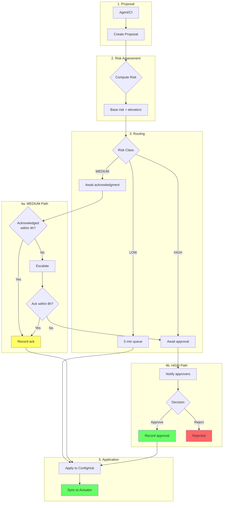

# Design: Approval Gates for High-Risk Changes

**Status**: Design document for ISSUE-15.3
**Depends on**: [risk-taxonomy.md](risk-taxonomy.md), [design-agent-proposal-workflow.md](design-agent-proposal-workflow.md)

---

## Core Principle

**Policy enforcement is automated. Approval is human judgment.**

| Layer | Question | Authority | Blocking |
|-------|----------|-----------|----------|
| **Policy** | "Is this valid?" | Machine rules | Always (invalid = blocked) |
| **Approval** | "Should we apply now?" | Human approvers | HIGH risk only |

---

## Approval Requirements by Risk Class

| Risk Class | Approval | Delay | Rationale |
|------------|----------|-------|-----------|
| **LOW** | No | 5 min auto-apply | Safe; human can override during window |
| **MEDIUM** | **Acknowledge** | 4 hour window | Warrants visibility; must confirm awareness |
| **HIGH** | **Yes** | Blocked | Outage/data loss potential; explicit decision required |

---

## MEDIUM Risk: Acknowledgment Requirement

### The Problem

The original MEDIUM design (1-hour auto-approve + notification) provides **illusory safety**:
- Operators may ignore notifications (alarm fatigue)
- Auto-approve proceeds regardless of whether anyone looked
- No audit trail of who saw what
- "Notify and hope" is not a control

### Alternatives Evaluated

| Approach | Pros | Cons | Verdict |
|----------|------|------|---------|
| **A. Require acknowledgment** | Forces visibility, lighter than approval, audit trail | Could become rubber-stamp | **Selected** |
| **B. Require full approval** | Simpler model, clear safety | Increases approval fatigue, may be overkill | Rejected |
| **C. Time-of-day routing** | Matches human availability | Complex, timezone issues | Rejected |
| **D. Post-apply mandatory review** | Doesn't block velocity | Too late for some issues | Rejected |

### Decision: Require Acknowledgment

MEDIUM risk changes require **acknowledgment** (not approval):

1. **Proposal created** → Operators notified immediately
2. **4-hour window** → Any operator can acknowledge ("I've seen this")
3. **Acknowledgment received** → Auto-apply proceeds
4. **No acknowledgment in 4h** → Escalate to secondary on-call
5. **No acknowledgment in 8h** → Treat as HIGH (require approval)

**Key difference from approval**: Acknowledgment confirms visibility, not judgment. The operator is saying "I'm aware this is happening" not "I endorse this change."

### Why This Works

- **Addresses alarm fatigue**: Can't auto-apply without someone engaging
- **Lighter than approval**: No approve/reject decision required
- **Audit trail**: Records who acknowledged and when
- **Escalation path**: Unacknowledged changes don't silently apply
- **Preserves velocity**: Most MEDIUM changes apply within hours, not days

### Acknowledgment vs Approval

| Aspect | Acknowledgment (MEDIUM) | Approval (HIGH) |
|--------|-------------------------|-----------------|
| Question | "Did you see this?" | "Should we do this?" |
| Decision | None required | Approve or reject |
| Accountability | Visibility confirmed | Judgment exercised |
| Escalation | 4h → secondary, 8h → HIGH | 4h → secondary, 7d → expire |

---

## Approval Workflow



*Figure: Approval workflow showing LOW (auto-apply), MEDIUM (acknowledgment), and HIGH (approval) paths.*

---

## Approver Roles

| Role | Can Approve | Scope |
|------|-------------|-------|
| Platform Operator | Yes | All spaces |
| Environment Owner | Yes | Their environment |
| On-Call Engineer | Yes | Any (during rotation) |
| Agent | **No** | — |
| CI/Automation | **No** | — |

**Escalation**: 4h → secondary on-call, 24h → platform lead, 7 days → auto-reject (expired)

---

## Approval Record

Every decision recorded with: approver, role, timestamp, decision, reason, session metadata.
Provides accountability, audit trail, and reason capture.

---

## Blocking Behavior

HIGH risk proposals:
- State: `pending` (cannot progress to `applied`)
- Visible in approvals queue
- Approvers notified immediately
- **No auto-approve**, remains blocked until decision
- `--force` flag does **not** bypass approval

---

## Emergency Override (Break-Glass)

For true emergencies:
```bash
cub break-glass apply --space messagewall-prod --reason "..." --file fix.yaml
```

Break-glass applies immediately but:
- Logs with emergency flag
- Creates retroactive approval request
- Notifies all operators
- Requires post-incident review

See EPIC-17 for detailed break-glass workflow.

---

## Implementation: Git PR-Based Approvals (Phase 1)

| Concept | GitHub Implementation |
|---------|----------------------|
| Proposal | Pull Request |
| Risk Class | PR Label (`risk:low/medium/high`) |
| Approval | GitHub PR approval |
| Applied | PR merged |

CI workflow: compute risk → apply label → require approval for HIGH → block merge without approval.
CODEOWNERS controls who can approve.

---

## Metrics

| Metric | Alert Threshold |
|--------|-----------------|
| Pending count | > 10 |
| Oldest pending age | > 24 hours |
| Time to decision (p50) | > 4 hours |
| Rejected ratio | > 30% |

---

## Summary

**Key guarantees**:
1. HIGH risk blocked without approval
2. LOW risk auto-applies
3. All decisions auditable
4. Only humans can approve

---

## References

- [risk-taxonomy.md](risk-taxonomy.md) — **Canonical source** for risk class definitions and field mapping
- [design-agent-proposal-workflow.md](design-agent-proposal-workflow.md) — **Canonical source** for proposal lifecycle
- [machine-verifiable-invariants.md](machine-verifiable-invariants.md) — Invariant enforcement (complements approval)
- [invariants.md](invariants.md) — Invariant 9
- EPIC-17 — Production protection gates
