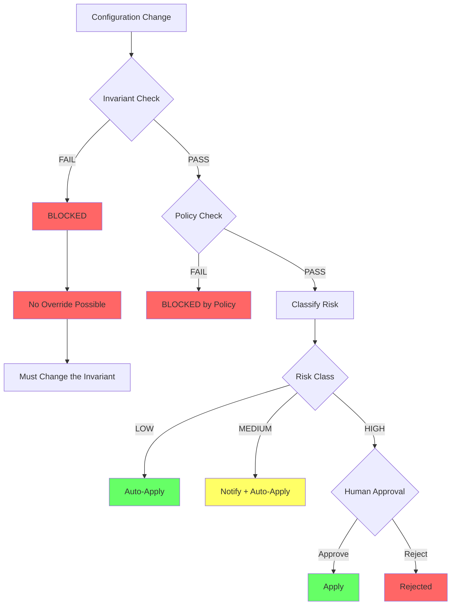

# Machine-Verifiable Invariants

**Status**: Exploration document for ISSUE-15.14
**Related**: [approval-fatigue-and-theater.md](approval-fatigue-and-theater.md)

---

## The Case for Invariants

Human approval fails at scale. But certain safety properties are machine-checkable:

| Machine-Checkable | Requires Human Judgment |
|-------------------|------------------------|
| IAM wildcards present? | Good architectural decision? |
| Production DB deletion? | Right time for change? |
| Memory within limits? | Business priority? |

**Principle**: Machine-checkable → invariant enforcement. Judgment calls → human approval.

---

## Invariants vs. Policies

| Aspect | Policy | Invariant |
|--------|--------|-----------|
| Purpose | Best practices | Prevent catastrophe |
| Response | May warn/block | Always blocks |
| Exceptions | Environment-specific | None |
| Override | Approvers | Change the invariant |
| Scope | Context-dependent | Universal |

---

## Candidate Invariants

| ID | Category | Rule | Prevents |
|----|----------|------|----------|
| INV-IAM-001 | IAM | No wildcard actions (`Action: "*"`) | Account compromise |
| INV-IAM-002 | IAM | No wildcard resources on s3/dynamodb/secrets | Data exfiltration |
| INV-IAM-003 | IAM | Permission boundary required | Privilege escape |
| INV-SCOPE-001 | Scope | Resource name prefix required | Scope escape |
| INV-SCOPE-002 | Scope | Approved regions only | Compliance violations |
| INV-DELETE-001 | Deletion | Prod DB deletion protection | Accidental data loss |
| INV-DELETE-002 | Deletion | S3 bucket empty before deletion | Data loss |
| INV-ENCRYPT-001 | Encryption | Prod DynamoDB encryption | Unencrypted data |
| INV-ENCRYPT-002 | Encryption | Prod S3 default encryption | Unencrypted data |
| INV-LIMIT-001 | Limits | Lambda memory 128-3008 MB | Resource abuse |
| INV-LIMIT-002 | Limits | Lambda timeout ≤ 300s | Resource abuse |

---

## Examples: Invariants Preventing Harm

| Scenario | Invariant | Result |
|----------|-----------|--------|
| Agent proposes `s3:*` on `Resource: "*"` | INV-IAM-002 | **BLOCKED** (no human asked) |
| Script deletes prod DB | INV-DELETE-001 | **BLOCKED** (must disable protection first) |
| Agent changes region to eu-west-1 | INV-SCOPE-002 | PASS → HIGH risk → human approval |

**Key insight**: Invariants block categorically dangerous changes. Human approval handles context-dependent decisions.

---

## Boundary: Invariants vs. Human Judgment

*Figure: Decision flow showing invariant enforcement (no override) vs. human judgment (HIGH risk approval).*

| Use Invariants For | Use Human Judgment For |
|--------------------|------------------------|
| Deterministic checks | Context awareness (timing, business) |
| Universal rules | Trade-off analysis |
| Catastrophe prevention | Stakeholder coordination |

**Don't ask humans** about wildcards, memory limits, or regions—convert these to invariants.

---

## Agent-to-Agent Approval (Future)

If invariants are comprehensive, agents could approve other agents for LOW risk changes:
- All catastrophic states prevented by invariants
- Proposing agent cannot approve itself
- Full audit trail

**Not a current goal**—requires comprehensive invariants and trust calibration first.

---

## Implementation

| Layer | Enforcement |
|-------|-------------|
| Pre-commit | Warning |
| CI | Block merge |
| ConfigHub | Block apply |
| Kyverno | Block admission |

Document all invariants in a central registry with test cases.

---

## Summary

**Key principle**: Machine-verifiable → invariant. Context-dependent → human.

---

## References

- [approval-fatigue-and-theater.md](approval-fatigue-and-theater.md)
- [invariants.md](invariants.md), [demo-policy-guardrails.md](demo-policy-guardrails.md)
- EPIC-14 — Policy implementation
