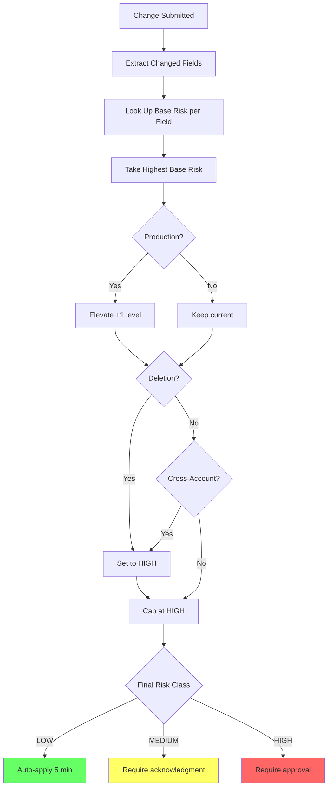

# Risk Taxonomy for Configuration Changes

**Status**: Authoritative reference (ISSUE-15.1)
**Supersedes**: [design-policy-risk-class-mapping.md](design-policy-risk-class-mapping.md)

---

## Risk Classes

This taxonomy classifies configuration changes by risk level to determine automation vs. human oversight.

### LOW Risk

Auto-apply without human involvement.

**Criteria** (all must be true):
- Reversible within minutes
- Single, non-stateful resource
- Within established bounds
- No security or data loss impact
- Non-production environment

**Examples**: Adjusting `lambdaMemory` or `lambdaTimeout` in dev, changing `eventSource` identifier.

---

### MEDIUM Risk

Auto-apply with notification. Operators can intervene.

**Criteria** (any):
- Multiple resources or cross-component
- Environment-scoped blast radius
- Reversal requires coordination
- Approaches policy thresholds
- Staging environment

**Examples**: Changing `environment` (dev→staging), `region`, `resourcePrefix`, or initial Claim deployment.

---

### HIGH Risk

Requires explicit human approval.

**Criteria** (any):
- Irreversible or expensive to reverse
- Security posture change (IAM, encryption)
- Data loss or outage potential
- Production environment
- Permission boundary changes
- Resource deletion

**Examples**: Production changes, IAM modifications, disabling encryption, deletions, `awsAccountId` changes.

---

## Schema Field Risk Classification

Each field in the `ServerlessEventAppClaim` schema has a **base risk class** that may be elevated by context.

### Spec Fields

| Field | Type | Required | Base Risk | Production Risk | Rationale |
|-------|------|----------|-----------|-----------------|-----------|
| `awsAccountId` | string | Yes | **HIGH** | HIGH | Immutable after creation; wrong value deploys to wrong account |
| `environment` | enum | Yes | MEDIUM | N/A | Changing to/from prod is itself the risk elevator |
| `resourcePrefix` | string | No | LOW | MEDIUM | Affects all resource names; prod changes affect prod resources |
| `region` | enum | No | MEDIUM | **HIGH** | Affects all ARNs; cross-region moves require coordination |
| `lambdaMemory` | integer | No | LOW | MEDIUM | Within bounds is low risk; prod needs change tracking |
| `lambdaTimeout` | integer | No | LOW | MEDIUM | Within bounds is low risk; prod needs change tracking |
| `eventSource` | string | No | LOW | LOW | Identifier only; no security or data impact |
| `artifactBucket` | string | No | MEDIUM | **HIGH** | Changes where Lambda code is sourced from |

### Change Operations

| Operation | Base Risk | Notes |
|-----------|-----------|-------|
| Create new Claim | MEDIUM | New resource creation is inherently coordinated |
| Modify existing Claim | *field-dependent* | See field table above |
| Delete Claim | **HIGH** | Always high risk; destroys all composed resources |

---

## Context Elevators

Contexts that automatically elevate risk class:

| Elevator | Effect | Rationale |
|----------|--------|-----------|
| **Production** | +1 level (LOW→MEDIUM, MEDIUM→HIGH) | Real user impact |
| **Deletion** | Always HIGH | Irreversible data loss |
| **Cross-Account** | Always HIGH | Wrong account = wrong security/billing |
| **Security Changes** | Always HIGH | IAM, encryption, network changes |

---

## Risk Calculation Algorithm



*Figure: Risk calculation decision tree showing base risk, elevators, and final routing.*

### Examples

| Change | Base | Elevators | Effective | Action |
|--------|------|-----------|-----------|--------|
| `lambdaMemory` 128→256 in dev | LOW | none | LOW | Auto-apply |
| `lambdaMemory` 256→512 in prod | LOW | prod +1 | MEDIUM | Acknowledge + apply |
| `region` change in prod | MEDIUM | prod +1 | HIGH | Approval required |
| Delete dev Claim | — | deletion | HIGH | Approval required |
| New prod Claim | MEDIUM | prod +1 | HIGH | Approval required |

---

## Validation Against Real Claims

### Dev Environment

| Change | Risk | Notes |
|--------|------|-------|
| Initial apply | MEDIUM | New creation |
| `lambdaMemory`/`lambdaTimeout` | LOW | Within bounds |
| `region` | MEDIUM | Cross-region coordination |
| Delete | HIGH | Always HIGH |
| `awsAccountId` | HIGH | Always HIGH |

### Prod Environment

| Change | Risk | Notes |
|--------|------|-------|
| Initial apply | HIGH | MEDIUM + prod elevator |
| `lambdaMemory`/`lambdaTimeout` | MEDIUM | LOW + prod elevator |
| `region` | HIGH | MEDIUM + prod elevator |
| `resourcePrefix` | MEDIUM | LOW + prod elevator |
| Delete | HIGH | Always HIGH |

---

## Integration with Policy Enforcement

| Concern | Mechanism | Behavior |
|---------|-----------|----------|
| **Policy Enforcement** | Kyverno, ConfigHub | Blocks invalid configs (hard rules) |
| **Risk Classification** | This taxonomy | Determines approval workflow (soft gates) |

**Key principle**: Policy violations always block. Risk classification only applies to changes that pass policy.

```
Change → Policy Check → [FAIL: blocked] or [PASS] → Risk Assessment → LOW/MEDIUM/HIGH workflow
```

---

## Compound Change Risk Classification

### The Problem

The naive "highest risk wins" approach is insufficient:

| Change | Naive Result | Actual Risk | Why |
|--------|--------------|-------------|-----|
| 5 LOW fields in dev | LOW | **MEDIUM** | Cumulative blast radius |
| `lambdaMemory` + `lambdaTimeout` in prod | MEDIUM | MEDIUM | Related fields, single concern |
| `region` + `resourcePrefix` + `artifactBucket` | HIGH | **HIGH** | Multiple unrelated HIGH-impact fields |
| `lambdaMemory` in 10 Claims | LOW per claim | **HIGH** | Fleet-wide change |

### Approaches Evaluated

| Approach | How It Works | Pros | Cons | Verdict |
|----------|--------------|------|------|---------|
| **A. Field count threshold** | ≥3 fields → elevate +1 | Simple | Ignores field relationships | Rejected |
| **B. Cumulative scoring** | LOW=1, MED=2, HIGH=4; sum and threshold | Nuanced | Complex, magic numbers | Rejected |
| **C. Concern-based grouping** | Related fields = 1 concern; unrelated = elevate | Semantic | Requires field relationship map | **Selected** |
| **D. Batch scope multiplier** | Multi-resource batches elevate | Catches fleet changes | Needs batch detection | Selected (additive) |

### Decision: Concern-Based + Batch Scope

**Rule 1: Concern-based grouping**
Fields are grouped by concern. Changing multiple fields in the same concern = single risk. Changing fields across concerns = elevate.

| Concern | Fields |
|---------|--------|
| Compute | `lambdaMemory`, `lambdaTimeout` |
| Identity | `awsAccountId`, `resourcePrefix` |
| Location | `region` |
| Source | `artifactBucket`, `eventSource` |
| Lifecycle | `environment` |

**Elevation rule**: Changing fields in **2+ unrelated concerns** → elevate +1 level.

**Rule 2: Batch scope multiplier**
Changes affecting multiple resources in a single operation:

| Batch Size | Effect |
|------------|--------|
| 1 resource | No change |
| 2-5 resources | Elevate +1 |
| 6+ resources | Elevate to HIGH |

### Updated Algorithm

```
1. Group changed fields by concern
2. Base risk = highest risk of any changed field
3. If 2+ concerns touched → elevate +1
4. If batch size 2-5 → elevate +1
5. If batch size 6+ → set to HIGH
6. Apply context elevators (prod, deletion, cross-account)
7. Cap at HIGH
```

### Examples with Compound Rules

| Change | Fields | Concerns | Base | Compound | Elevators | Final |
|--------|--------|----------|------|----------|-----------|-------|
| Memory + timeout in dev | 2 | 1 (Compute) | LOW | LOW | — | LOW |
| Memory + region in dev | 2 | 2 | MEDIUM | **MEDIUM+1=HIGH** | — | HIGH |
| Memory in 3 prod Claims | 1×3 | 1 | LOW | **+1 batch** | +1 prod | HIGH |
| Prefix + region + bucket | 3 | 3 | HIGH | HIGH (capped) | — | HIGH |

---

## Open Questions

| Question | Status | Notes |
|----------|--------|-------|
| Risk computed vs declared? | Start computed | Fall back to declared for ambiguous cases |
| Compound risk? | **Resolved** | Concern-based grouping + batch multiplier (see above) |
| Approval delegation? | Deferred | See ISSUE-15.14 (machine-verifiable invariants) |
| Time-based modifiers? | Deferred | May contribute to approval fatigue |

---

## Canonical Locations (EPIC-15 Consolidation)

This document is the **authoritative source** for risk classification. Other EPIC-15 docs reference but do not redefine these concepts:

| Concept | Canonical Location | Referenced By |
|---------|-------------------|---------------|
| Risk class definitions (LOW/MEDIUM/HIGH) | This document | All EPIC-15 docs |
| Schema field risk mapping | This document | proposal-workflow, approval-gates |
| Context elevators (prod, deletion) | This document | proposal-workflow |
| Compound risk calculation | This document | — |
| Approval workflow mechanics | [design-approval-gates.md](design-approval-gates.md) | proposal-workflow, fatigue |
| Acknowledgment vs approval | [design-approval-gates.md](design-approval-gates.md) | fatigue |
| Proposal lifecycle | [design-agent-proposal-workflow.md](design-agent-proposal-workflow.md) | approval-gates |
| Policy vs approval distinction | [design-approval-gates.md](design-approval-gates.md) | invariants |
| Invariant enforcement | [machine-verifiable-invariants.md](machine-verifiable-invariants.md) | approval-gates, fatigue |
| Approval fatigue mitigations | [approval-fatigue-and-theater.md](approval-fatigue-and-theater.md) | — |

---

## References

- [design-policy-risk-class-mapping.md](design-policy-risk-class-mapping.md) — Working model this formalizes
- [invariants.md](invariants.md) — Platform invariants (Invariant 9)
- [demo-policy-guardrails.md](demo-policy-guardrails.md) — Policy examples
- EPIC-15, EPIC-17 — Consumers of this taxonomy
