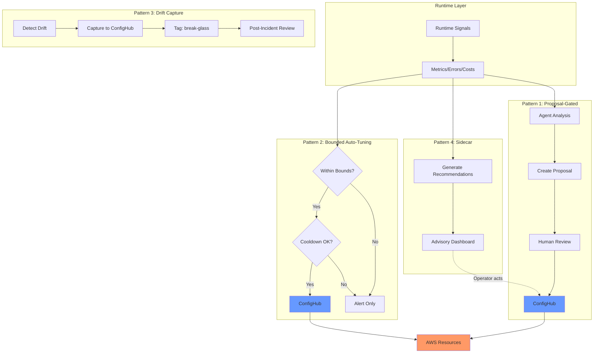

# Runtime Feedback Loops into Configuration Authority

**Status**: Exploration document for ISSUE-15.17
**Related**: [risk-taxonomy.md](risk-taxonomy.md), [design-agent-proposal-workflow.md](design-agent-proposal-workflow.md)

---

## Opportunity and Risk

**Opportunity**: Runtime signals (metrics, errors, costs) could automatically inform configuration improvements.

**Risk**: Unconstrained feedback loops can oscillate, amplify noise, optimize for wrong metrics, or cascade failures.

---

## Feedback Loop Patterns

*Figure: Four feedback loop patterns showing how runtime signals flow through the authority plane.*

| Pattern | How It Works | When to Use |
|---------|--------------|-------------|
| **Proposal-Gated** | Runtime → Agent → Proposal → Human review | Most scenarios (safe default) |
| **Bounded Auto-Tuning** | Runtime → Adjust within human-defined bounds + cooldown | Well-understood, low-risk adjustments |
| **Drift Capture** | Detect drift → Capture to authority (not revert) → Tag for review | Break-glass emergencies |
| **Recommendation Sidecar** | Runtime → Advisory recommendations (separate from config) | Human judgment needed |

**Key properties**:
- Proposal-gated: Authority plane stays authoritative, full audit trail
- Auto-tuning: Bounds in schema, cooldown prevents oscillation
- Drift capture: Update authority to match reality, requires post-incident review
- Sidecar: No automatic application, operators review at their pace

---

## Preserving Authority

1. **Authority plane stays authoritative**: Runtime → Authority plane → AWS (never bypass)
2. **Complete audit trail**: Source, evidence, classification, timestamp
3. **Human-defined bounds**: Auto-tuning within schema-defined limits
4. **Cooldowns**: Minimum time between automated changes

---

## Runaway Risks and Mitigations

| Risk | Pattern | Mitigation |
|------|---------|------------|
| **Oscillation** | Two metrics drive opposite actions | Cooldowns, hysteresis, multi-metric |
| **Amplification** | Noise → large changes | Sustained duration, step limits, caps |
| **Metric Gaming** | Optimize metric, not goal | Multiple metrics, human review |
| **Cascading** | System A change → B → C | Settling time, global rate limits |
| **Drift from Tested** | Config never tested as combination | Staging validation, periodic reset |

---

## Signal Trust Levels

| Signal | Trust | Notes |
|--------|-------|-------|
| CloudWatch (7+ days) | High | Performance tuning |
| Sustained error rates | High | Reliability |
| Cost reports | High | Right-sizing |
| Single-event spikes | Low | Don't react |
| New deployment metrics | Low | Wait for settling |

---

## Summary

**Key principle**: Runtime informs authority; it doesn't replace it.

---

## References

- [ADR-011](decisions/011-ci-confighub-authority-conflict.md) — Drift capture
- [design-agent-proposal-workflow.md](design-agent-proposal-workflow.md), [risk-taxonomy.md](risk-taxonomy.md)
