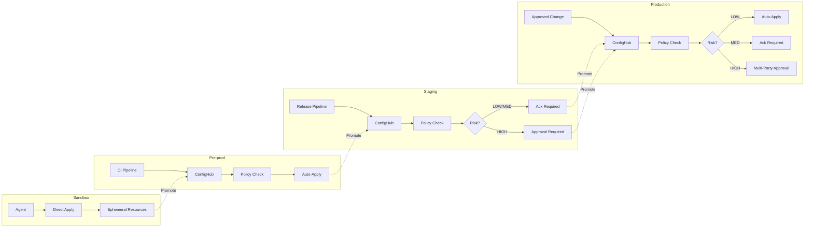

# Tiered Authority Model

**Status**: Design document for ISSUE-18.2
**Related**: [Centralized Authority Limits](centralized-authority-limits.md), [Approval Gates](design-approval-gates.md), [Risk Taxonomy](risk-taxonomy.md)

---

## Principle

**Strict where it matters. Fast where it's safe.**

Not all environments need the same governance. Production databases need delete gates and human approval. Throwaway PR environments need fast creation and automatic cleanup. A single authority posture cannot serve both.

---

## Authority Tiers

Four tiers, ordered by increasing governance:

| Tier | Purpose | Lifetime | Examples |
|------|---------|----------|----------|
| **Sandbox** | Individual experimentation | Hours to days | Local dev, PR previews, agent experiments |
| **Pre-prod** | Integration testing | Days to weeks | CI environments, load test targets |
| **Staging** | Release validation | Weeks to months | Shared staging, demo environments |
| **Production** | Live workloads | Indefinite | Customer-facing, stateful, precious |

---

## Tier Definitions

### Sandbox

**Purpose**: Fast iteration without coordination overhead.

| Attribute | Value |
|-----------|-------|
| **ConfigHub registration** | Optional |
| **Approval required** | None |
| **Policy enforcement** | Relaxed (warnings, not blocks) |
| **Delete gates** | None |
| **Data classification** | No real data allowed |
| **Retention** | Auto-expire after 24-72 hours |
| **Cleanup** | Automatic garbage collection |

**Who uses it**: Individual developers, AI agents exploring configuration space, CI pipelines for ephemeral tests.

**Key constraint**: Sandbox resources cannot access production data or credentials.

---

### Pre-prod

**Purpose**: Integration and performance testing with moderate governance.

| Attribute | Value |
|-----------|-------|
| **ConfigHub registration** | Required |
| **Approval required** | None for LOW/MEDIUM risk; HIGH risk needs lead approval |
| **Policy enforcement** | Enforced (same policies as prod, relaxed thresholds) |
| **Delete gates** | None for stateless; optional for databases |
| **Data classification** | Synthetic or anonymized only |
| **Retention** | 7-30 days default, extendable |
| **Cleanup** | Manual or scheduled |

**Who uses it**: QA teams, performance engineers, integration test suites.

**Key constraint**: Must not contain PII or production secrets.

---

### Staging

**Purpose**: Final validation before production with near-production governance.

| Attribute | Value |
|-----------|-------|
| **ConfigHub registration** | Required |
| **Approval required** | LOW auto-approve; MEDIUM needs acknowledgment; HIGH needs approval |
| **Policy enforcement** | Enforced (production policies, production thresholds) |
| **Delete gates** | Required for stateful resources |
| **Data classification** | Anonymized production-like data |
| **Retention** | Indefinite (until explicitly decommissioned) |
| **Cleanup** | Manual with approval |

**Who uses it**: Release managers, demo preparation, customer-facing pre-release.

**Key constraint**: Changes should mirror the production deployment process.

---

### Production

**Purpose**: Live workloads with maximum protection.

| Attribute | Value |
|-----------|-------|
| **ConfigHub registration** | Required |
| **Approval required** | LOW auto-approve; MEDIUM needs acknowledgment; HIGH needs multi-party approval |
| **Policy enforcement** | Strictly enforced, no exceptions |
| **Delete gates** | Required for all stateful resources |
| **Data classification** | Real customer data |
| **Retention** | Indefinite with backup requirements |
| **Cleanup** | Prohibited without explicit decommission workflow |

**Who uses it**: Operations teams, on-call engineers, approved CI/CD pipelines.

**Key constraint**: All changes auditable; no direct access without break-glass.

---

## Gate Posture by Tier

```
            Sandbox    Pre-prod    Staging    Production
            ───────    ────────    ───────    ──────────
Delete      None       Optional    Required   Required + approval
Destroy     None       None        Required   Required + multi-party
Modify      None       None        Logged     Logged + approval (HIGH)
Create      None       None        Logged     Logged
```

### Gate Definitions

| Gate | What It Blocks | Override Mechanism |
|------|----------------|-------------------|
| **Delete** | Removal of a resource | Explicit `--force` or approval |
| **Destroy** | Permanent data loss (e.g., drop table, empty bucket) | Multi-party approval + justification |
| **Modify** | Changes to protected fields | Approval workflow |
| **Create** | (Rarely gated) | Used for cost control in shared tiers |

---

## Approval Requirements by Tier and Risk

Cross-referencing [Risk Taxonomy](risk-taxonomy.md) with tiers:

| Risk Class | Sandbox | Pre-prod | Staging | Production |
|------------|---------|----------|---------|------------|
| **LOW** | Auto | Auto | Auto | Auto |
| **MEDIUM** | Auto | Auto | Ack | Ack |
| **HIGH** | Auto | Lead | Approval | Multi-party |

**Legend**:
- **Auto**: No human intervention
- **Ack**: Human must acknowledge (click to proceed)
- **Lead**: Team lead or senior engineer approval
- **Approval**: Designated approver from approval group
- **Multi-party**: Two approvers from different groups

---

## Multi-Tenant Considerations

When multiple teams share infrastructure, tier boundaries must remain isolated:

### Isolation Requirements

| Boundary | Mechanism |
|----------|-----------|
| **Namespace isolation** | Each tenant gets dedicated Kubernetes namespace per tier |
| **ConfigHub space isolation** | Separate spaces: `{tenant}-sandbox`, `{tenant}-prod` |
| **Credential isolation** | Distinct IAM roles per tenant per tier |
| **Network isolation** | VPC/subnet separation for prod; shared acceptable for sandbox |

### Tenant Cannot Weaken Another Tenant's Production

**Invariant**: Tenant A's sandbox configuration cannot affect Tenant B's production resources.

Enforcement mechanisms:
1. **IAM boundaries**: Tenant credentials scoped to tenant resources only
2. **Kyverno policies**: Resource names must match tenant prefix
3. **ConfigHub spaces**: Cross-space references prohibited without explicit grant

### Shared Infrastructure

Some infrastructure is shared across tenants (Crossplane, ArgoCD, Kyverno). This infrastructure:
- Lives in a dedicated `platform` tier with production-level governance
- Is managed by platform team, not tenant teams
- Has its own approval workflow independent of tenant tiers

---

## Tier Transitions

Resources can move between tiers with appropriate ceremony:

### Promotion (lower → higher tier)

```
Sandbox → Pre-prod → Staging → Production
```

| Transition | Requirements |
|------------|--------------|
| Sandbox → Pre-prod | Register in ConfigHub, pass policy validation |
| Pre-prod → Staging | Pass integration tests, approval from QA |
| Staging → Production | Pass release checklist, change advisory approval |

### Demotion (higher → lower tier)

Demotion is rare but valid (e.g., decommissioning a service):

| Transition | Requirements |
|------------|--------------|
| Production → Staging | Data migration plan, customer notification |
| Staging → Pre-prod | Remove from release pipeline |
| Pre-prod → Sandbox | Remove ConfigHub registration (optional) |

### Emergency Promotion (break-glass)

In emergencies, sandbox/pre-prod config may need to reach production:

1. Break-glass approval from on-call lead
2. Apply with `--emergency` flag (logged, time-bounded)
3. Reconciliation required within 1 hour
4. Post-incident review of the promotion

---

## ConfigHub Space Naming Convention

Consistent naming enables automation and policy enforcement:

```
{application}-{tier}[-{variant}]

Examples:
  messagewall-sandbox
  messagewall-preprod
  messagewall-staging
  messagewall-prod

  messagewall-sandbox-agent-exp-42   (agent experiment variant)
  messagewall-preprod-loadtest       (dedicated load test)
```

### Space Metadata

Each space carries tier metadata for policy enforcement:

```yaml
space: messagewall-prod
metadata:
  tier: production
  tenant: messagewall
  data-classification: customer-pii
  delete-protection: enabled
  approvers: ["platform-leads", "messagewall-oncall"]
```

---

## Diagram: Tier Authority Flow



---

## Summary

| Tier | Governance | Key Protection | Primary User |
|------|------------|----------------|--------------|
| **Sandbox** | Minimal | Isolation only | Developers, agents |
| **Pre-prod** | Light | Policy enforcement | QA, CI pipelines |
| **Staging** | Moderate | Delete gates, ack required | Release managers |
| **Production** | Maximum | All gates, multi-party approval | Operations |

The tiered model enables:
- **Speed** in sandbox/pre-prod where iteration matters
- **Safety** in staging/production where mistakes are costly
- **Isolation** so tenant boundaries are never crossed
- **Auditability** with increasing rigor as tiers increase

---

## References

- [Centralized Authority Limits](centralized-authority-limits.md) — why one-size-fits-all fails
- [Risk Taxonomy](risk-taxonomy.md) — LOW/MEDIUM/HIGH classification
- [Approval Gates](design-approval-gates.md) — approval workflow details
- [ConfigHub Bypass Criteria](confighub-bypass-criteria.md) — when to skip ConfigHub entirely
