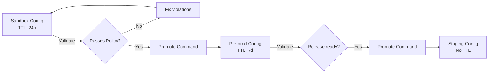

# Time-Scoped Configuration

**Status**: Design document for ISSUE-18.3
**Related**: [Tiered Authority Model](tiered-authority-model.md), [Centralized Authority Limits](centralized-authority-limits.md)

---

## Problem

Sandbox and experimental configurations accumulate as drift:
- Developer creates PR preview environment, forgets to clean up
- Agent experiments with 50 config variants, abandons 49
- Load test spins up resources, test fails, resources linger

Without expiration semantics, sandbox tiers become graveyards of orphaned configuration.

---

## Design: TTL-Based Configuration

Configuration units in sandbox/pre-prod tiers carry a **time-to-live (TTL)** that triggers automatic expiration.

### Core Concepts

| Concept | Definition |
|---------|------------|
| **TTL** | Duration after which config expires (e.g., `24h`, `7d`) |
| **Created timestamp** | When the config was first applied |
| **Last-touched timestamp** | When config was last modified or explicitly renewed |
| **Expiration mode** | What happens at expiration: `delete`, `archive`, or `warn` |

### TTL Behavior

```
Created ──────────────────────────────► Expires
         │                              │
         │  ◄── TTL window ───────────► │
         │                              │
         └── Touch resets TTL ──────────┘
```

**Touch events** that reset TTL:
- Explicit renewal (`cub unit renew`)
- Configuration update (`cub unit update`)
- Successful apply (`cub unit apply`)

**Non-touch events** (do not reset TTL):
- Read operations
- Status queries
- Policy checks

---

## Configuration Schema

```yaml
unit: messagewall-sandbox-preview-123
space: messagewall-sandbox
metadata:
  tier: sandbox
  ttl: 24h
  expiration-mode: delete
  created: 2026-01-18T10:00:00Z
  last-touched: 2026-01-18T14:30:00Z
  expires-at: 2026-01-19T14:30:00Z   # computed: last-touched + ttl
  owner: agent:claude-exp-42
```

### TTL Defaults by Tier

| Tier | Default TTL | Max TTL | Expiration Mode |
|------|-------------|---------|-----------------|
| Sandbox | 24h | 72h | delete |
| Pre-prod | 7d | 30d | archive |
| Staging | none | none | n/a |
| Production | none | none | n/a |

Staging and Production do not support TTL — configuration persists until explicitly removed.

---

## Expiration Modes

### Delete

Config and associated resources are removed entirely.

```
Expires → Delete from ConfigHub → Trigger resource cleanup → Gone
```

**Use for**: Ephemeral previews, agent experiments, throwaway tests.

### Archive

Config is marked inactive and hidden from default views, but retained for audit.

```
Expires → Mark archived → Hide from listings → Retain 90 days → Purge
```

**Use for**: Pre-prod environments where history matters for debugging.

### Warn

Config remains active but generates alerts. Human must explicitly renew or delete.

```
Expires → Generate warning → Daily alerts → Human action required
```

**Use for**: Shared pre-prod resources that shouldn't silently disappear.

---

## Promotion: Escaping TTL

When sandbox configuration is ready for a higher tier, it must be **promoted** rather than having its TTL extended indefinitely.

### Promotion Flow



### Promotion Command

```bash
# Promote sandbox config to pre-prod
cub unit promote messagewall-sandbox-preview-123 \
  --to-space messagewall-preprod \
  --new-name messagewall-preprod-feature-x

# Promotion automatically:
# - Runs target-tier policy validation
# - Copies config to new space
# - Applies target-tier TTL defaults
# - Archives source config (optional)
```

### Promotion Requirements

| From → To | Requirements |
|-----------|--------------|
| Sandbox → Pre-prod | Pass pre-prod policies |
| Pre-prod → Staging | Pass staging policies + QA approval |
| Staging → Production | Pass prod policies + change advisory approval |

---

## Preventing Production Leakage

Provisional config must never reach production without explicit promotion.

### Guardrails

1. **TTL presence blocks promotion to prod**
   - Config with any TTL cannot be promoted directly to production
   - Must first promote to staging (no TTL), then to production

2. **Tier metadata is immutable**
   - Cannot change `tier: sandbox` to `tier: production` via update
   - Tier changes require promotion workflow

3. **Cross-tier references prohibited**
   - Sandbox config cannot reference production secrets
   - Policy blocks `spec.secretRef` pointing to prod namespace

4. **Owner tracking**
   - Sandbox config tracks creating agent/user
   - Production config requires explicit ownership transfer

### Policy Example

```rego
# Block TTL config from production spaces
deny[msg] {
  input.space == "messagewall-prod"
  input.metadata.ttl
  msg := "Production config cannot have TTL"
}

# Block sandbox config referencing prod secrets
deny[msg] {
  input.metadata.tier == "sandbox"
  input.spec.secretRef.namespace == "production"
  msg := "Sandbox config cannot reference production secrets"
}
```

---

## Garbage Collection

A background process reaps expired configuration:

### GC Behavior

```
Every 15 minutes:
  For each sandbox/pre-prod space:
    Find units where now() > expires-at
    For each expired unit:
      If expiration-mode == "delete":
        Delete associated Kubernetes resources
        Delete ConfigHub unit
        Log deletion event
      If expiration-mode == "archive":
        Mark unit as archived
        Log archive event
      If expiration-mode == "warn":
        Send notification to owner
        Log warning event
```

### GC Safety

- GC only runs on sandbox and pre-prod tiers
- GC requires `tier` metadata to be present (missing = skip)
- GC logs all actions for audit
- GC can be paused per-space for maintenance

---

## Renewal Patterns

### Explicit Renewal

```bash
# Renew for another TTL period
cub unit renew messagewall-sandbox-preview-123

# Renew with extended TTL (up to max)
cub unit renew messagewall-sandbox-preview-123 --ttl 48h
```

### Activity-Based Renewal

For active development, each update resets TTL automatically:

```bash
# This implicitly renews
cub unit update messagewall-sandbox-preview-123 --set spec.memory=512Mi
```

### CI Integration

PR pipelines can auto-renew associated preview environments:

```yaml
# In CI pipeline
- name: Renew preview environment
  run: cub unit renew messagewall-sandbox-pr-${{ github.event.pull_request.number }}
  continue-on-error: true  # OK if doesn't exist yet
```

When PR is merged or closed, CI stops renewing → config expires → resources cleaned up.

---

## Agent Experiment Lifecycle

Agents creating experimental configurations follow this pattern:

```
1. Agent creates sandbox config with TTL
   → cub unit create --space sandbox --ttl 24h

2. Agent runs experiment
   → Apply, observe, iterate

3. Experiment succeeds
   → cub unit promote --to-space preprod

4. Experiment fails or abandoned
   → Do nothing, TTL expires, GC cleans up
```

This design means agents don't need cleanup logic — expiration handles abandoned experiments automatically.

---

## Summary

| Aspect | Design Choice |
|--------|---------------|
| **Mechanism** | TTL on config units, reset by touch events |
| **Defaults** | Sandbox: 24h, Pre-prod: 7d, Staging/Prod: none |
| **Expiration modes** | Delete, archive, or warn |
| **Promotion** | Required to escape TTL; validates target-tier policies |
| **Leakage prevention** | TTL blocks prod promotion; cross-tier refs prohibited |
| **GC** | Background process every 15 min, sandbox/pre-prod only |

---

## References

- [Tiered Authority Model](tiered-authority-model.md) — tier definitions and governance
- [Centralized Authority Limits](centralized-authority-limits.md) — why ephemeral config needs different treatment
- [ConfigHub Bypass Criteria](confighub-bypass-criteria.md) — when to skip ConfigHub entirely
